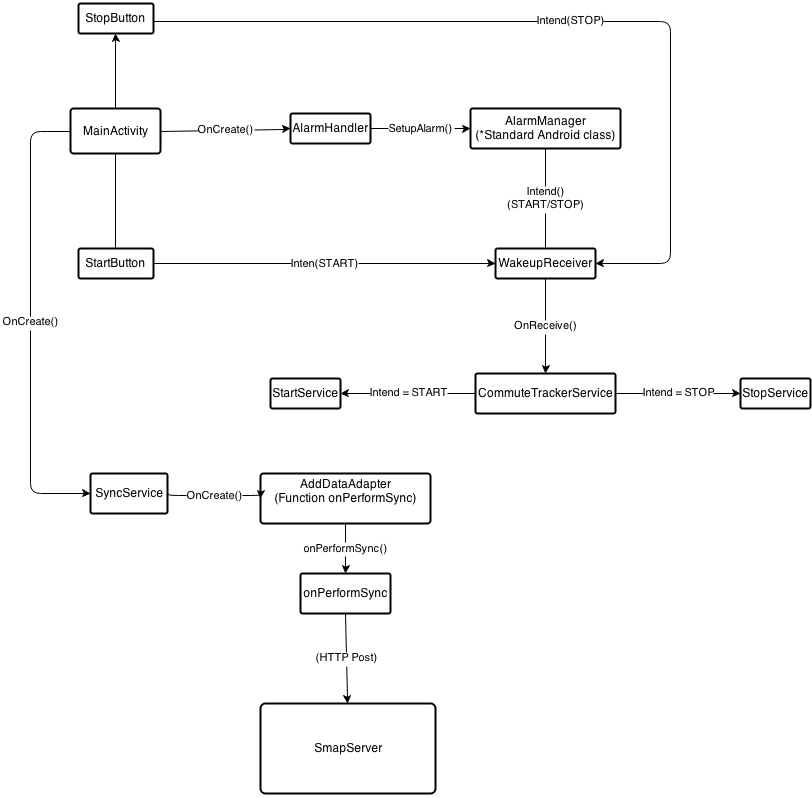

# Sample sensor reading app for android

This is a sample app for reading sensor data from android phones and publishing
it to SMAP.  It currently reads and pushes GPS and accelerometer data. It uses
the recommended AbstractThreadedSyncAdapter mechanism to push the collected
data every 30 minutes, or whenever the network becomes available.

The sensors are currently collected in two ways:
- Through the use of a listener (used for location)
- Through polling - we turn the accelerometer on for 10 secs every minute

The app has several features that allows it to be useful as a continuous sensing app. It runs in the background as a service, and is autolaunched on reboot.

A brief diagram of the information flow shown below:

INSTALLATION INSTRUCTIONS:
 - edit `edu.berkeley.eecs.cfc_tracker.smap.AddDataAdapter` and
  - change the `SMAP_HOST` variable to the server where you plan to push data. e.g. 
        private static String SMAP_HOST = "http://www.mybmsserver.org/backend/";
  - change the `SMAP_KEY` variable to the key to access sMAP.
        private static String SMAP_KEY = "YOUR_BMS_KEY_HERE";
 - edit `edu.berkeley.eecs.cfc_tracker.smap.MainActivity` and
  - change the `ACCOUNT_TYPE` variable to point to your server, e.g.
        public static final String ACCOUNT_TYPE = "mybmsserver.org";

That's it! Now deploy your application - it should pop up an activity with
start, stop and sync buttons. You can use these to manually control the data
collection, and override the automatic operation of the app. Now, edit the app
as you desire, add a fancy UI, add more sensors, go to town!
