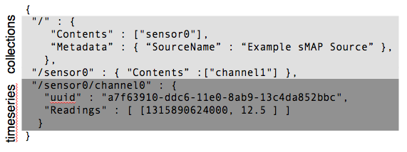

sMAP Introduction
=================

Welcome!  sMAP, or the Simple Measurement and Actuation Profile is a
specification for a protocol which easily and quickly exposes and
publishes time-series data from a wide variety of sensors simply and
flexibly.

The sMAP architecture consists of several components which may be used
together to capture, transmit, store, and present time-series data:

* **sMAP Sources** communicate with existing instrumentation, and
  collect time-series data using a large variety of underlying
  protocols.  They use the `sMAP Library` to describe and reliably
  communicate this data to consumers, as well as provide uniform
  access to actuators.

* the **sMAP Archiver** is a high-performance historian for storing
  large volumes of stored data.  It provides a simple and powerful
  interface for making use of historical data and real-time data, and
  addresses `locating` and `cleaning` the raw data.

* **Applications** make use of historical and/or real-time data in
  order to achieve a higher-level goal; for instance, providing
  attractive visualizations, computing optimal control strategies,
  or providing user feedback.  By default, the sMAP project provides
  **powerdb2**, a time-series organization and plotting application.

.. figure:: resources/highlevel.png
   :align: center

   The sMAP architecture consists of several interlocking pieces:
   `Sources`, `Archivers`, and `Applications`.

These components can be used as a whole system or in pieces using
published interfaces; for instance, creating a sMAP source to expose
existing instrumentation but then transmitting the data to a separate
(non-sMAP) repository using the documented interfaces.

sMAP Sources
------------

The first, essential piece of sMAP is a library for creating sMAP
sources. These sources connect to existing instrumentation and provide
tools for exposing the data over http/sMAP. The library and protocol
are designed to support various common scenarios:

* Intermittent connectivity: provide local buffering
* Local metadata: apply tags at the source
* Bulk loading and real-time: support both bulk-loads from existing
  databases and real-time data from streaming or polling sources in the
  same framework.  
* Actuation (using SSL)

.. image:: resources/smap.png
   :align: center

The sMAP Library provides tools for creating and managing these
sources.  Each source contains one or more **drivers**, which contains
code to communicate with sources of data; common drivers used Modbus,
BACnet or HTTP/XML to retrieve new data.  Writing drivers is the most
common way to extend sMAP code, and the focus of the
:ref:`driver-tutorial`.

The Archiver
------------

The archiver is a historian, and provides drivers a place for
instruments to send their data. It supports:

* Efficient storage and retrieval of time-series data

* Maintenance of metadata using structured key-value pairs

* Selection of time series using the :ref:`ArchiverApi` REST API and the
  :ref:`ArchiverQuery` language

.. figure:: resources/archiver.png
   :align: center

   The archiver is a service which connects to a relational database (postgres) and time series database (readingdb) to provide storage of data.

Front-ends
----------

Most systems provide some amount of dashboarding and plotting. Out of
the box, the **powerdb2** project provides plotting and organization
of time-series data. Due to the decoupled nature of sMAP, this
front-end can be run by anyone without installing the database. The
application is designed to give users a large amount of flexibility to
organize, display and plot streams using :ref:`ArchiverQuery` to generate
tree views of their streams.

A *powerdb2* instance serving up large volumes of data is publicly
available at `www.openbms.org <http://new.openbms.org/plot/>`_.  For
example, you can take a look at:

* `building elevator consumption <http://new.openbms.org/plot/?streamids=6458bf87-1601-5725-846a-4b4d713312c6,d26f4650-329a-5e14-8e5a-73e820dff9f0,87c395em-5em3-5713-8928-c29e32937877&start=1362428640000&end=1362515040000&stack=false&tree=2&axes=1,1,1&tree=2&path=elevator>`_
* `room temperature vs. setpoint <http://new.openbms.org/plot/?streamids=18ee1d6b-5306-5560-860f-5eaef2fb8c16,4aea6ecd-ca3b-5871-a75f-e694968d8c4f&start=1362428760000&end=1362515160000&stack=false&tree=9&axes=1,1&tree=9&path=Sutardja%20Dai%20Hall,S5-12>`_
* `total electric load in california <http://new.openbms.org/plot/?streamids=3b8f38f1-333a-5e93-8553-7291cd6b21cf&start=1362428760000&end=1362515160000&stack=false&tree=0&axes=1&tree=0&path=ISO%20Data,CAISO,Generation,Total%20Area>`_
* `insolation and temperature on a campus building <http://new.openbms.org/plot/?streamids=f13513ba-7759-57ad-a6e3-52dc3ef0aa7f,ec2b82c2-aa68-50ad-8710-12ee8ca63ca7&start=1362428760000&end=1362515160000&stack=false&tree=0&axes=1,2&tree=0&path=Cory%20Hall%20Rooftop%20Weather,cory_roof,pth>`_

.. _key-concepts:

Key Concepts
------------

In order to understand sMAP data, it will be helpful to understand two
things.

Collection and Timeseries
~~~~~~~~~~~~~~~~~~~~~~~~~

At its core, sMAP provides a facility for publishing *collections* and
*time series*. A time series is a single stream of scalar-valued
readings which have some logical association with each other -- they
are typically produced by an instrument channel.  A collection is an
unordered set of these timeseries.  sMAP allows collections to nest,
so the contents of collections is either other collections, or time
series.

   sMAP organizes data as time series objects contained within
   collections.  Collections provide a mechanism for applying metadata
   to a set of timeseries.

sMAP specifies schemas for both collections and time series.  It
additionally specifies how these abstract objects can be exposed over
HTTP, and provides a method for callbacks to provide notifications of
new data or events.  Each timeseries is globally identified by a
Universal Unique Identifier (UUID), which is a 128-bit name generated
to be unique with high probability.  These provide the basis for
naming all sMAP data.

Metadata
~~~~~~~~

Time series are uniquely identified by UUID; however, these
identifiers are unpleasant to use in practice.  Therefore, sMAP allows
additional metadata to be attached as *tags*: structured key-value
pairs.  For instance, all time series are required to have a
*Properties/UnitofMeasure* tag containing engineering units for the
data in question.  

Metadata in sources is applied hierarchically; tags applied to a root
resource like ``/`` apply to all time series and collection contained
in that resource.

:ref:`metadata-tags` contains a list of suggested suggested metadata
tags; the better-tagged your time series are, the easier and more
natural it will be to retrieve data.

Implementation
--------------

Most sMAP users will want to use the sMAP source library to implement
their sources.  This library makes it easy to create and configure
data sources which feed into the overall system The sMAP library is
implemented using :py:mod:`twisted`, an asynchronous event system for
python.  It takes care of serving up sMAP resources over HTTP and
managing data being sent to various subscribers.  It supports both
programmatic creation of sMAP server, creating a server from a
configuration file, or a combination.  The :py:mod:`smap.drivers`
package contains many drivers which ship with sMAP.

The sMAP archiver is a separate service which can be used in
conjunction with sMAP sources.  Also written in Python, it uses
`readingdb <https://github.com/stevedh/readingdb>`_ as a
high-performance time series store which allows it to serve large
volumes of data very quickly. 
