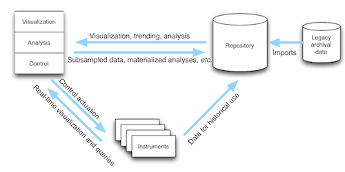

.. sMAP documentation master file, created by
   sphinx-quickstart on Sun Jul 10 22:16:43 2011.
   You can adapt this file completely to your liking, but it should at least
   contain the root `toctree` directive.

sMAP: the Simple Measurement and Actuation Profile
==================================================

An enormous amount of physical information; that is, information from
and about the world is available today as the cost of communication
and instrumentation has fallen. However, making use of that
information is still challenging. The information is frequently siloed
into proprietary systems, available only in batch, fragmentary, and
disorganized. The sMAP project aims to change this by making available
and usable:

* a :download:`specification <resources/v2.pdf>` for transmitting physical data and describing its contents,
* a :ref:`large set <driver-index>` of free and open drivers with communicating with devices using native protocols and transforming it to the sMAP profile, and
* tools for building, organizing, and querying large repositories of physical data.

The core object in sMAP is the timeseries, a single progression of
``(time, value)`` tuples. Each timeseries in sMAP is identified by a ``UUID``,
and can be tagged with metadata; all grouping of time series occurs
using these tags. These objects are exchanged between all components
in this ecosystem.

.. toctree::
   :maxdepth: 2

   intro
   install
   python_access
   R_access
   tutorial

   drivers 
   archiver
   
   tools
   internals
   driver_index

   additional

Indices and tables
==================

* :ref:`genindex`
* :ref:`modindex`
* :ref:`search`

